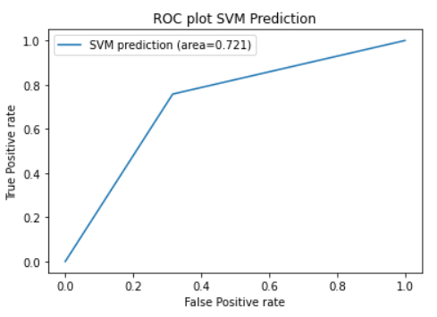

# Heart Failure Prediction

# Introduction
Heart disease is one of the most significant
problem that is arising in the world today.
Cardiovascular disease prediction is a critical
challenge in the area of clinical data analysis. 

Cardiovascular diseases (CVDs) are the number 1 cause of death globally, taking an estimated 17.9 million lives each year, which accounts for 31% of all deaths worldwide. Four out of 5CVD deaths are due to heart attacks and strokes, and one-third of these deaths occur prematurely in people under 70 years of age. Heart failure is a common event caused by CVDs and this dataset contains 11 features that can be used to predict a possible heart disease.

People with cardiovascular disease or who are at high cardiovascular risk (due to the presence of one or more risk factors such as hypertension, diabetes, hyperlipidaemia or already established disease) need early detection and management wherein a machine learning model can be of great help.

The prediction model is proposed with
combinations of different features and several
classification techniques.

# Attribute Information
1. Age: age of the patient [years]
2. Sex: sex of the patient [M: Male, F: Female]
3. ChestPainType: chest pain type 
4. RestingBP: resting blood pressure [mm Hg]
5. Cholesterol: serum cholesterol [mm/dl]
6. FastingBS: fasting blood sugar 
7. RestingECG: resting electrocardiogram results
8. MaxHR: maximum heart rate achieved 
9. ExerciseAngina: exercise-induced angina [Y: Yes, N: No]
10. Oldpeak: oldpeak = ST 
11. ST_Slope: the slope of the peak exercise ST segment 
12. HeartDisease: output class [1: heart disease, 0: Normal]

# Workflow
1. Importing Required Libraries
2. Load the Dataset
3. EDA(Exploratory Data Analysis
4. Data Cleaning and preprocessing
5. Data Visualization
6. Training the model 
7. Predict the accuracies of all 6 classifiers
8. Comparing performance of the models

# Data Visualization
ROC Curves of models.
1. Random Forest Classifier 
 
2. K Nearest Neighbour 
 
3. Decision Tree Classifier 
 
4. Gradient Boosting Classifier 
 
5. .Logistic Regression 
 
6. SVM(Support Vector Machine) 
 

# Advantages of Heart Failure Prediction
1. Increased accuracy for effective heart
disease diagnosis.
2. Handles roughest(enormous) amount of
data using random forest algorithm and
feature selection.
3. Reduce the time complexity of doctors.
4. Cost effective for patients.

# Disadvantages of Heart Failure Prediction
* Prediction of cardiovascular disease
results is not that accurate.

# Accuracies gained by the models
1. RandomForest	88.260870
2. KNeighbors	73.913043
3. DecisionTree	79.130435
4. GradientBoosting	87.826087
5. Logistic Regression	0.847826
6. Support vector machine	0.726087

# Conclusion
we proposed a method for heart
disease prediction using machine learning
techniques, these results showed a great
accuracy standard for producing a better
estimation result. By introducing new proposed
Random forest classification, we find the
problem of prediction rate without equipment
and propose an approach to estimate the heart
rate and condition. Sample results of heartrate
are to be taken at different stages of the same
subjects, we find the information from the above
input via ML Techniques.
